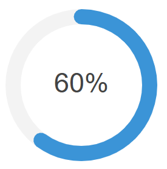

# Overview

This component uses the react-circular-progressbar library to visually display progress in the form of a circular indicator. It provides a simple and flexible way to represent percentages, scores, or completion status in a clean, animated circular style.

## Circular progress bar

## QodlySource

| Name        | Type   | Required | Description                                                                                 |
| ----------- | ------ | -------- | ------------------------------------------------------------------------------------------- |
| Qodlysource | number | Yes      | Will contain the percentage that will be represented by the circular progress bar (eg: 60). |

## Properties

| Name               | Type    | Default | Description                                                                                  |
| ------------------ | ------- | ------- | -------------------------------------------------------------------------------------------- |
| Stroke width       | number  | 10      | It represents the stroke's width                                                             |
| Display background | boolean | false   | When set to true, the circle's background will be displayed                                  |
| Background padding | number  | 0       | If the background is displayed, a padding will be visible and can be set using this property |
| Counter clockwise  | boolean | false   | If set to true, the progressbar will rotate in counterclockwise direction                    |
| Path color         | string  | #3498db | It represents the filled progressbar color                                                   |
| Trail color        | string  | #f3f3f3 | It represents the empty progressbar color                                                    |
| Show text          | boolean | true    | When set to true, the text / percentage value will be visible                                |
| Font size          | number  | 18      | It represents the text's font size                                                           |
| Font color         | string  | #444444 | It represents the text's font color                                                          |
